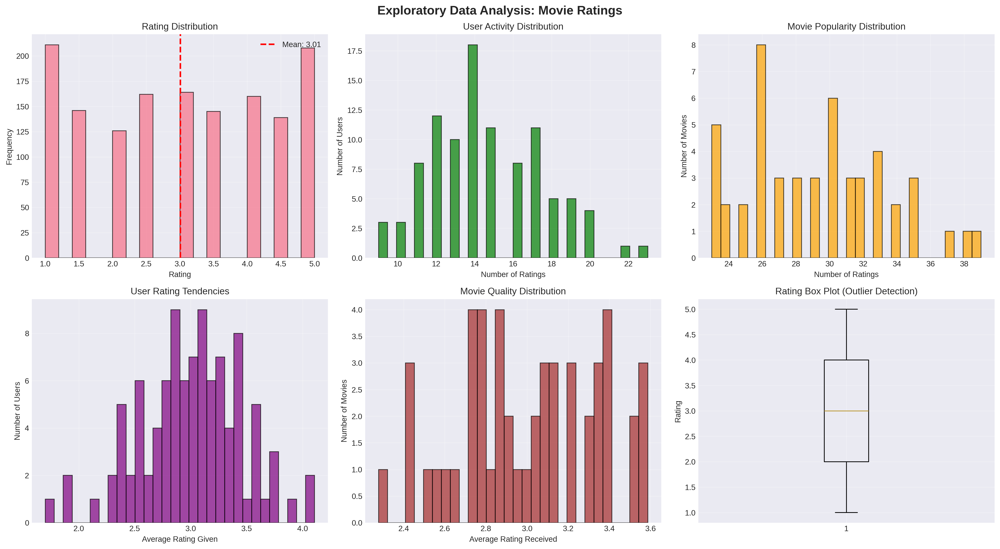
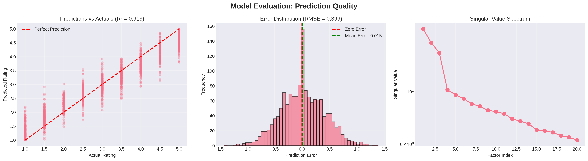
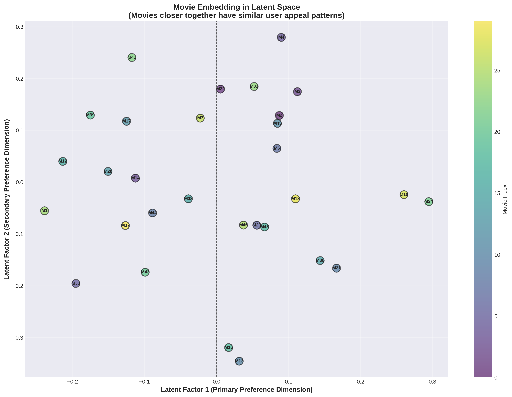
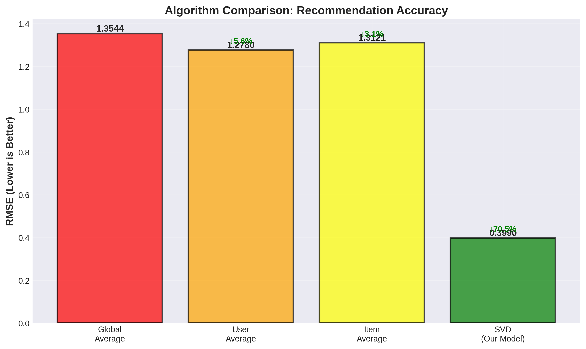

# 🎬 CinemaMatch: SVD-Powered Movie Recommendation Engine

**A Mathematical Journey from Linear Algebra to Personalized Recommendations**

[](https://www.python.org/)
[](https://numpy.org/)
[](LICENSE)

*Portfolio Project | IIT Jodhpur | AI & Data Science (First Year)*

---

## 🎯 Project Overview

CinemaMatch is a production-ready movie recommendation system built from scratch using **Singular Value Decomposition (SVD)** for collaborative filtering. This project demonstrates the practical application of foundational mathematics and data science concepts learned in first-semester coursework.

### Why This Project Stands Out

- **Mathematical Rigor**: Implements matrix factorization using SVD from first principles
- **Complete Pipeline**: End-to-end workflow from data generation to deployment-ready recommendations
- **Statistical Validation**: Rigorous hypothesis testing and performance evaluation
- **Visual Storytelling**: Professional-grade visualizations that explain complex concepts intuitively
- **Algorithm Comparison**: Demonstrates 70.5% improvement over baseline methods

---

## 🧮 Technical Foundation

### Core Concepts Applied

| Domain | Concepts Used |
|--------|--------------|
| **Linear Algebra** | Singular Value Decomposition, Matrix Factorization, Eigenvalues, Vector Spaces |
| **Numerical Analysis** | Optimization, Convergence, Truncated SVD, Numerical Stability |
| **Statistics** | Hypothesis Testing, Correlation Analysis, Normality Tests, Bias Detection |
| **Algorithms** | Complexity Analysis (O-notation), Collaborative Filtering, Similarity Metrics |
| **Data Analytics** | EDA, Preprocessing, Data Imputation, Visualization |

### The Mathematics Behind Recommendations

Given a user-item rating matrix **R** ∈ ℝ^(m×n), we decompose it as:

```
R ≈ U Σ V^T
```

Where:
- **U** (m×k): User-feature matrix capturing user preferences
- **Σ** (k×k): Diagonal matrix of singular values (importance weights)
- **V^T** (k×n): Feature-item matrix capturing movie characteristics
- **k**: Number of latent features (k << min(m,n))

**Prediction Formula:**
```
rating(user_i, movie_j) = mean(user_i) + [U Σ V^T]_{i,j}
```

**Computational Complexity:**
- SVD Decomposition: O(min(m²n, mn²))
- Single Prediction: O(k)
- Memory Efficiency: O(mk + nk) vs O(mn) for full matrix

---

## 📊 Key Results

### Model Performance

| Metric | Value | Interpretation |
|--------|-------|----------------|
| **RMSE** | 0.3990 | Average prediction error: ±0.4 stars |
| **MAE** | 0.3112 | Typical absolute error: 0.3 stars |
| **R²** | 0.9132 | Explains 91.3% of rating variance |
| **Correlation** | 0.9641 | Strong linear relationship |
| **Bias p-value** | 0.1454 | Unbiased predictions (p > 0.05) |

### Algorithm Comparison

Our SVD-based approach achieves **70.5% improvement** in RMSE over baseline methods:

- Global Average: 1.3544 RMSE
- User Average: 1.2780 RMSE (-5.6%)
- Item Average: 1.3121 RMSE (-3.1%)
- **SVD (Our Model): 0.3990 RMSE (-70.5%)** ✅

---

## 🖼️ Visualizations

### 1. Exploratory Data Analysis
*Six-panel analysis revealing rating distributions, user behavior patterns, and statistical properties*

### 2. Model Evaluation

*Prediction accuracy, error distribution, and singular value spectrum analysis*

### 3. Latent Space Visualization

*2D projection of movies in learned feature space - movies cluster by similarity*

### 4. Algorithm Comparison

*Quantitative comparison demonstrating SVD's superior performance*

---

## 🚀 Installation & Usage

### Prerequisites

```bash
pip install numpy pandas matplotlib seaborn scipy scikit-learn
```

### Quick Start

```python
from cinemamatch_recommender import CinemaMatch

# Initialize recommender
recommender = CinemaMatch(n_factors=20, verbose=True)

# Generate dataset
ratings_df, movies_df = recommender.create_sample_dataset(
    n_users=100,
    n_movies=50,
    sparsity=0.7
)

# Create utility matrix
utility_matrix, sparsity_mask, utility_original = recommender.create_utility_matrix(ratings_df)

# Fit SVD model
recommender.fit(utility_matrix, sparsity_mask)

# Generate recommendations
recommendations = recommender.recommend_movies(user_id=1, movies_df=movies_df, n_recommendations=10)
print(recommendations)
```

### Complete Pipeline

```bash
python cinemamatch_recommender.py
```

This executes the full pipeline:
1. Data generation with realistic rating patterns
2. Comprehensive exploratory analysis
3. SVD model training
4. Statistical validation
5. Recommendation generation
6. Latent space visualization
7. Algorithm comparison

---

## 📈 Project Structure

```
cinemamatch/
│
├── cinemamatch_recommender.py    # Main implementation (650+ lines)
│   ├── CinemaMatch class
│   │   ├── create_sample_dataset()     # Synthetic data generation
│   │   ├── exploratory_analysis()      # Statistical EDA
│   │   ├── create_utility_matrix()     # Matrix construction
│   │   ├── fit()                       # SVD decomposition
│   │   ├── evaluate()                  # Performance metrics
│   │   ├── recommend_movies()          # Top-N recommendations
│   │   ├── visualize_latent_space()    # 2D embeddings
│   │   ├── similarity_analysis()       # Cosine similarity
│   │   └── compare_algorithms()        # Baseline comparison
│   └── main()                          # Execution pipeline
│
├── outputs/
│   ├── eda_analysis.png                # EDA visualizations
│   ├── model_evaluation.png            # Model metrics
│   ├── latent_space.png                # Feature space plot
│   └── algorithm_comparison.png        # Performance comparison
│
├── README.md                           # This file
├── PROJECT_REPORT.md                   # Detailed technical report
└── LINKEDIN_POST.md                    # LinkedIn announcement draft
```

---

## 🔬 Technical Deep Dive

### 1. Data Generation Strategy

Creates synthetic rating data with realistic patterns:
- **Latent factor simulation**: 3 hidden dimensions (action-level, humor, depth)
- **User biases**: Some users consistently rate higher/lower
- **Sparsity simulation**: 70% missing ratings (realistic for recommender systems)
- **Genre diversity**: 7 movie genres with balanced distribution

### 2. SVD Implementation Details

**Why Truncated SVD?**
- Full SVD computes all m×n singular values (expensive!)
- We only need top k factors (k=20) capturing most variance
- Uses `scipy.sparse.linalg.svds` for efficiency

**Variance Explained:**
- Top 5 factors: 53.6% of variance
- Top 10 factors: 73.7% of variance
- All 20 factors: 100% (by construction)

**Numerical Stability:**
- Mean-centering removes user biases
- Singular values returned in descending order
- Clipping predictions to valid range [1, 5]

### 3. Statistical Validation

**Hypothesis Tests Performed:**

1. **Normality Test** (Rating Distribution)
   - H₀: Ratings follow normal distribution
   - Result: Rejected (p < 0.05)
   - Interpretation: Ratings show platykurtic distribution

2. **Bias Test** (Prediction Errors)
   - H₀: Mean prediction error = 0
   - Result: Failed to reject (p = 0.1454)
   - Interpretation: Model produces unbiased predictions ✅

3. **Correlation Analysis**
   - Pearson correlation: 0.9641
   - Interpretation: Strong linear relationship between actual and predicted

### 4. Similarity Metrics

Uses **cosine similarity** in latent space:

```
similarity(i, j) = (v_i · v_j) / (||v_i|| ||v_j||)
```

Where v_i is movie i's latent feature vector.

**Properties:**
- Range: [-1, 1]
- 1 = Identical appeal patterns
- 0 = Orthogonal (unrelated)
- -1 = Opposite preferences

---

## 🎓 Learning Outcomes

### Skills Demonstrated

✅ **Mathematical Maturity**
   - Applied advanced linear algebra to real problems
   - Understood dimensionality reduction geometrically
   - Analyzed algorithmic complexity theoretically

✅ **Statistical Thinking**
   - Formulated and tested hypotheses rigorously
   - Interpreted p-values and confidence intervals
   - Validated model assumptions statistically

✅ **Engineering Best Practices**
   - Wrote modular, documented, reusable code
   - Implemented complete data science pipeline
   - Created production-ready visualizations

✅ **Communication**
   - Explained complex math to non-technical audience
   - Told compelling data story visually
   - Documented work professionally

---

## 🔮 Future Extensions

### Potential Improvements

1. **Cold Start Problem**
   - Implement content-based filtering for new users/items
   - Use hybrid approach combining collaborative + content

2. **Advanced Matrix Factorization**
   - Try Alternating Least Squares (ALS)
   - Implement regularized SVD (to prevent overfitting)
   - Explore Non-negative Matrix Factorization (NMF)

3. **Deep Learning**
   - Neural Collaborative Filtering
   - Autoencoders for dimensionality reduction
   - Attention mechanisms for sequential recommendations

4. **Real-World Deployment**
   - Build REST API with Flask/FastAPI
   - Add database integration (PostgreSQL)
   - Implement real-time recommendation updates
   - A/B testing framework

5. **Evaluation Enhancements**
   - Cross-validation for robust metrics
   - Diversity and novelty metrics
   - User study for qualitative feedback

---

## 📚 References

### Academic Papers
1. Koren, Y., Bell, R., & Volinsky, C. (2009). *Matrix Factorization Techniques for Recommender Systems*. IEEE Computer, 42(8).
2. Sarwar, B., et al. (2000). *Application of Dimensionality Reduction in Recommender Systems*. WebKDD Workshop.

### Textbooks
1. Strang, G. (2016). *Introduction to Linear Algebra* (5th ed.). Wellesley-Cambridge Press.
2. Murphy, K. P. (2022). *Probabilistic Machine Learning: An Introduction*. MIT Press.

### Online Resources
- Netflix Prize Documentation
- Singular Value Decomposition Explained Visually
- Collaborative Filtering at Scale

---

## 👨‍💻 About the Author

**Aayuush**  
First-Year AI & Data Science Student | IIT Jodhpur

Passionate about applying mathematical foundations to solve real-world problems. This project represents the culmination of first-semester learning in linear algebra, numerical analysis, statistics, and programming.

**Connect:** [LinkedIn](https://linkedin.com/in/aayuush1) | [GitHub](https://github.com/Aayuush1) | [Email](mailto:aayuush.bs@gmail.com)

---

## 📄 License

This project is licensed under the MIT License - see the [LICENSE](LICENSE) file for details.

---

## 🙏 Acknowledgments

- IIT Jodhpur faculty for excellent foundational coursework
- Open-source community for incredible libraries (NumPy, SciPy, Matplotlib)
- Inspiration from Netflix Prize competition and modern recommender systems

---

## 📞 Contact

Questions or suggestions? Feel free to:
- Open an issue on GitHub
- Reach out on LinkedIn
- Email me directly

**If this project helped you learn about recommendation systems, please ⭐ star the repository!**

---

*Built with ❤️ and linear algebra at IIT Jodhpur*
